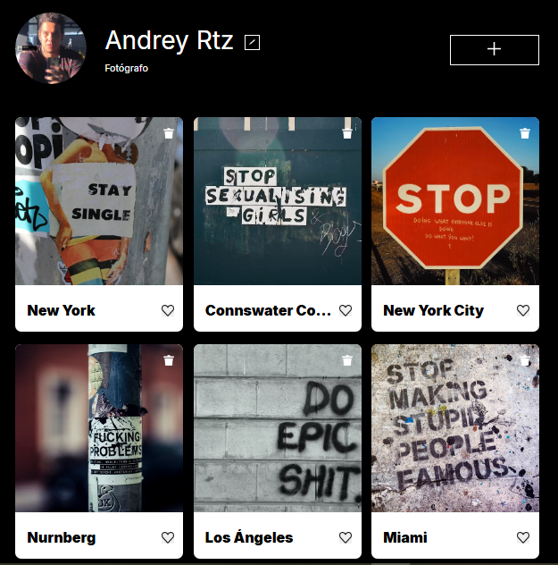
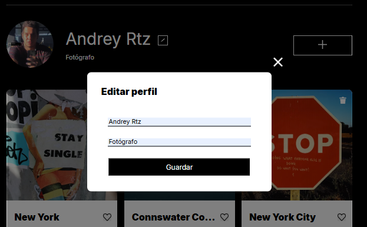
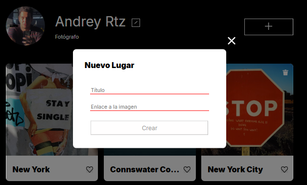
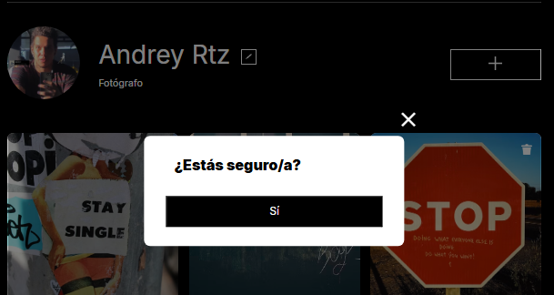
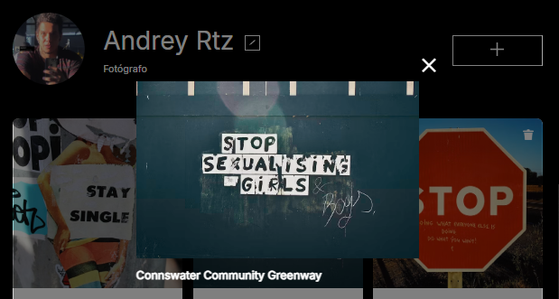

# Tripleten web_project_around
 

Proyecto: web_project_around

Aplicación web tipo red social para compartir fotos. Permite explorar una galería, subir imágenes con descripciones, editar perfil, dar/quitar “me gusta” y eliminar publicaciones propias. Usa popups modales, validación de formularios y se integra con una API para datos dinámicos.

**Funciones principales:** 

-Galería con imágenes, likes y autor.
-Edición de perfil usando popup.
-Subida de fotos con título y url de imagen.
-Vista ampliada de imágenes usando popup.
-Eliminación de imagen con confirmación previa.
-Likes con contador en tiempo real.
-Validación en formularios.

La app es responsive y se conecta a una API real o simulada.

## Tecnologías y Técnicas Utilizadas

HTML5: estructura semántica de página, popups y formularios.

CSS3: estilos con metodología BEM, uso de Normalize.css y tipografía Inter. Bloques: page, header, profile, card, popup, footer.

JavaScript (ES6+): módulos, clases y promesas para la lógica principal. Clases clave: Card, PopupWithForm, UserInfo, Section, FormValidator.

API: integración vía fetch para operaciones CRUD en /cards y /users/me.

Eventos: listeners para clics, envíos de formularios y tecla ESC.

 URL: https://andreyrtz.github.io/web_project_around/

## Capturas de Pantalla

### -Página Principal

 
### Popup Editar Perfil

 

### Agregar Nueva Imagen

 ### Confirmación de Eliminación
 
 

### Imagen Ampliada

##### Autor
Andrey Ortiz

